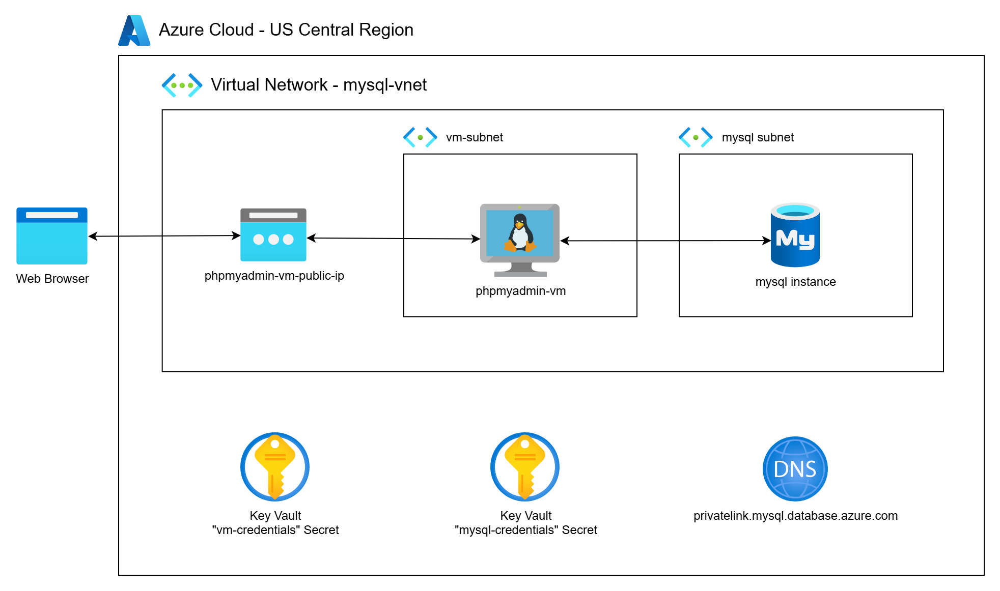

# Deploying MySQL on Azure

This project demonstrates how to deploy a secure, private MySQL Flexible Server on Microsoft Azure using Terraform.

The deployment provisions a fully managed Azure MySQL Flexible Server with public access disabled, integrated into a custom virtual network, and secured using a Private DNS Zone to enable internal name resolution. To provide convenient, private access for database interaction, the project also deploys a lightweight Ubuntu virtual machine that runs [phpMyAdmin](https://www.phpmyadmin.net/), a browser-based MySQL client accessible only within the virtual network.

As part of the setup, the [Sakila](https://dev.mysql.com/doc/sakila/en/) sample database—a fictional movie rental database—is loaded into the MySQL instance to demonstrate real-world queries, administration, and access control in a secure, private cloud environment. This solution is ideal for developers and teams building internal-facing applications without exposing database endpoints to the public internet.



## What You'll Learn

- How to deploy a fully private MySQL Flexible Server on Azure using Terraform
- How to configure a custom virtual network, subnet, and Private DNS Zone for secure, internal connectivity
- How to provision a VM running `phpMyAdmin` for private browser-based database access
- Best practices for securing Azure-managed databases using private networking and infrastructure-as-code

## Overview of Azure Database for MySQL – Flexible Server

Historically, Azure offered two deployment options for managed MySQL databases: **Flexible Server** and **Single Server**. Single Server is being retired in March 2025, and Flexible Server is now the recommended option for all new deployments due to its superior flexibility, performance, and security features.

This project uses **MySQL Flexible Server** with private networking, ensuring that your database is fully isolated within an Azure Virtual Network. This configuration supports secure, internal-only access—perfect for production workloads, enterprise security requirements, and regulated environments.

### Comparison: Flexible Server vs Single Server

| **Aspect**                     | **Flexible Server**                                                                                 | **Single Server (Legacy)**                                                              |
|-------------------------------|------------------------------------------------------------------------------------------------------|-----------------------------------------------------------------------------------------|
| **Networking**                | Supports private endpoints and full VNet integration                                                | Public access with limited VNet support                                                |
| **Availability Zones**        | Supports zone redundancy for high availability                                                      | Limited to single-AZ deployments                                                       |
| **Maintenance Control**       | Fine-grained control over patching and maintenance windows                                          | Limited user control                                                                   |
| **Scaling & Bursting**        | Supports burstable SKUs, autoscaling storage, and custom backup retention                           | Limited scaling options                                                                |
| **Stop/Start Capabilities**   | Manual stop/start for dev/test cost savings                                                         | Not supported                                                                          |
| **High Availability**         | Built-in HA with same-zone or zone-redundant standby                                                 | Asynchronous geo-redundant replica (manual promotion required)                         |
| **Recommended For**           | Production workloads needing performance, flexibility, and private access                          | Legacy workloads; not recommended for new deployments                                  |

### Notes on Azure vs AWS

While AWS offers Aurora MySQL with a distributed backend and serverless options, Azure’s Flexible Server provides a more conventional MySQL experience focused on **network security, fine-grained operational control, and predictable cost**. Azure currently does not have a direct match to Aurora's shared-storage architecture but offers powerful VNet-integrated MySQL deployments suitable for most use cases.

## Choosing the Right Azure Option

- **Use MySQL Flexible Server** if you require private networking, high availability, and better control over backups, maintenance, and performance.
- [**Avoid Single Server**](https://techcommunity.microsoft.com/blog/adformysql/retiring-azure-database-for-mysql-single-server-in-2025/3829798) for new applications—it is deprecated and lacks modern enterprise capabilities.

## Prerequisites

* [An Azure Account](https://portal.azure.com/)
* [Install AZ CLI](https://learn.microsoft.com/en-us/cli/azure/install-azure-cli) 
* [Install Latest Terraform](https://developer.hashicorp.com/terraform/install)

If this is your first time watching our content, we recommend starting with this video: [Azure + Terraform: Easy Setup](https://youtu.be/j4aRjgH5H8Q). It provides a step-by-step guide to properly configure Terraform, and the AZ CLI.

## Download this Repository

```bash
git clone https://github.com/mamonaco1973/azure-mysql.git
cd azure-mysql
```

## Build the Code

Run [check_env](check_env.sh) then run [apply](apply.sh).

```bash
Destroy complete! Resources: 22 destroyed.
~/azure-mysql$ ./apply.sh
NOTE: Validating that required commands are found in your PATH.
NOTE: az is found in the current PATH.
NOTE: terraform is found in the current PATH.
NOTE: jq is found in the current PATH.
NOTE: All required commands are available.
NOTE: Validating that required environment variables are set.
NOTE: ARM_CLIENT_ID is set.
NOTE: ARM_CLIENT_SECRET is set.
NOTE: ARM_SUBSCRIPTION_ID is set.
NOTE: ARM_TENANT_ID is set.
NOTE: All required environment variables are set.
NOTE: Logging in to Azure using Service Principal...
NOTE: Successfully logged into Azure.
Initializing the backend...
Initializing provider plugins...
- Reusing previous version of hashicorp/azurerm from the dependency lock file
- Reusing previous version of hashicorp/random from the dependency lock file
- Using previously-installed hashicorp/azurerm v4.35.0
- Using previously-installed hashicorp/random v3.7.2

Terraform has been successfully initialized!
```
## Build Results

After applying the Terraform scripts, the following Azure resources will be created:

### Virtual Network & Subnet
- Virtual Network: `mysql-vnet`
  - Address space: `10.0.0.0/23`
- Subnet for MySQL Flexible Server: `mysql-subnet`
  - Address range: `10.0.0.0/25`
- Network Security Group: `mysql-nsg`
  - Allows inbound MySQL traffic on port 3306 from the phpMyAdmin VM

### Private DNS & Networking
- Private DNS Zone: `privatelink.mysql.database.azure.com`
  - Enables internal name resolution for the private MySQL server
- Private Endpoint:
  - Linked to the MySQL Flexible Server
  - Associated with the custom subnet and DNS zone

### Azure Key Vault
- Key Vault: `creds-kv`
  - Stores MySQL credentials securely
  - Access granted via Key Vault policy

### MySQL Flexible Server
- Server Name: Defined in variables
- Configuration:
  - Private access only (public network access disabled)
  - Admin credentials retrieved from Azure Key Vault
  - Preloaded with the [Sakila sample database](https://dev.mysql.com/doc/sakila/en/)

### Virtual Machine (phpMyAdmin)
- VM Name: `phpmyadmin-vm`
  - Ubuntu-based VM to host the `phpMyAdmin` interface
  - Deployed in the same virtual network
  - Connected privately to the MySQL server
  - Configured to launch `phpMyAdmin` and expose a browser-based MySQL UI

## phpMyAdmin Demo

[phpMyAdmin](https://www.phpmyadmin.net/) is a popular web-based MySQL administration tool that allows users to interact with MySQL and MariaDB databases through a browser interface. It supports query execution, database browsing, import/export, and user management—all from a secure, private environment.


Query 1:
```sql
SELECT
    -- Select the film title from the 'film' table and label the column 'film_title'
    f.title AS film_title,

    -- Concatenate the actor's first and last name with a space between them and label the column 'actor_name'
    CONCAT(a.first_name, ' ', a.last_name) AS actor_name

FROM
    -- Use the 'film' table as the main source of data (alias 'f')
    sakila.film f

    -- Join the 'film_actor' link table to associate films with their actors by film_id
    JOIN sakila.film_actor fa
        ON f.film_id = fa.film_id

    -- Join the 'actor' table to get actor name details by actor_id
    JOIN sakila.actor a
        ON fa.actor_id = a.actor_id

-- Sort the results first by film title alphabetically, then by actor name alphabetically within each film
ORDER BY
    f.title,
    actor_name

-- Return only the first 20 rows of the result set
LIMIT 20;                                                   
```

Query 2:

```sql
SELECT
    -- Select the film title from the 'film' table
    f.title,

    -- Concatenate all actor full names (first + last name) into a single string
    -- GROUP_CONCAT builds this list, ordering by actor last name, separating each with a comma and space
    GROUP_CONCAT(
        CONCAT(a.first_name, ' ', a.last_name)
        ORDER BY a.last_name
        SEPARATOR ', '
    ) AS actor_names

FROM
    -- Use the 'film' table as the starting point (aliased as 'f')
    sakila.film f

    -- Join 'film_actor' to link films to their actors via film_id
    JOIN sakila.film_actor fa
        ON f.film_id = fa.film_id

    -- Join 'actor' to get the actual actor names via actor_id
    JOIN sakila.actor a
        ON fa.actor_id = a.actor_id

-- Group results by film title so each row represents a unique film
GROUP BY
    f.title

-- Sort the output rows alphabetically by film title
ORDER BY
    f.title

-- Only return the first 10 rows (the top 10 film titles alphabetically)
LIMIT 10;
```
